# Programmer som data - Eksamen
Andreas Nicolaj Tietgen

anti@itu.dk

Jeg erklærer hermed at jeg selv har lavet hele denne eksamensbesvarelse uden hjælp fra andre.

## Opgave 1

### 1. 
For at kunne udskrive numbers er følgende blevet skrevet.
```F#
Every (Write (numbers));;
```
Det giver nedenstående output:

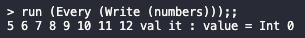

### 2.
For at skrive tal fra `numbers` som er større end 10 så kan følgende blive skrevet:
```F#
Every(Write(Prim("<", CstI (10), numbers)));;
```
Det giver nedenstående output:

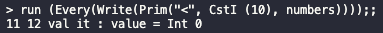

### 3. 
For at kunne udskrive de tal som er større end for sekvensen af numbers kan følgende blive skrevet:
```F#
(Every (Write (Prim("<", numbers, Seq(Write(CstS("\n")), numbers)))));;
```
Det giver følgende output i terminalen:

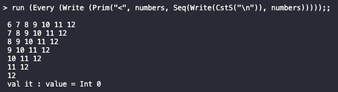

### 4.
For at løse opgaven antager jeg at vi har med et alfabet som kun har store bogstaver og som kun indeholder ASCII bogstaver fra A-Z.

Koden for at løse dette er således:
```F#
let rec eval (e : expr) (cont : cont) (econt : econt) = 
    match e with
    | ...
    | FromToChar (c1, c2) -> 

      // Create loop function to provide chars to the continuation function  
      let rec loop = function
        | c :: cs -> cont (Str (c.ToString())) (fun () -> loop cs) 
        | [] -> econt ()

      // Create a function that checks that the char, c, is between ch1 and ch2
      let charIsBetweenInclusive (c, ch1, ch2) =
        let cv = int(c)
        let cv1 = int(ch1)
        let cv2 = int(ch2)

        cv >= cv1 && cv <= cv2
      
      // Check that c2 is greater than or equal to c1
      match (System.Char.ToUpper(c1), System.Char.ToUpper(c2)) with
      | ch1, ch2 when int(c2) - int(c1) < 0 -> Str "c2 is not greater than c1"
      | ch1, ch2 -> 
        "ABCDEFGHIJKLMNOPQRSTUVWXYZ".ToCharArray() 
        |> List.ofArray 
        |> List.filter (fun c -> charIsBetweenInclusive (c, ch1, ch2))
        |> loop
```

### 5.
For at løse dette eksempel er følgende tilføjet til evalueringen af `Prim`:
```F#
let rec eval (e : expr) (cont : cont) (econt : econt) = 
    match e with
    | ...
    | Prim(ope, e1, e2) -> 
      eval e1 (fun v1 -> fun econt1 ->
          eval e2 (fun v2 -> fun econt2 -> 
              match (ope, v1, v2) with
              | ...
              | ("<", Str s1, Str s2) -> 
                if s1 < s2 then
                  cont (Str s2) econt2
                else 
                  econt2 ()
              econt1)
          econt
```

Det har givet følgende resultat når det bliver kørt i terminalen:

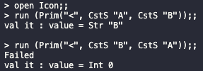

### 6.
Jeg har skrevet følgende udtryk:
```
Every(Write(Prim("<", CstS "G", chars)));;
```

Dette giver nedenstående resultat:
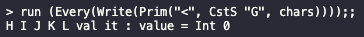

## Opgave 2
\
### 1. 

For at kunne parse de nye keywords, så bliver vi nødt til at generere dem som tokens først ved hjælp af vores lexer, `CLex.fsl`:
```F#
let keyword s =
    match s with
    | ...
    | "createStack" -> CREATESTACK
    | "pushStack" -> PUSHSTACK
    | "popStack" -> POPSTACK
    | "printStack" -> PRINTSTACK
    | ... 
```

Herefter skal vi registrere de nye tokens i vores Parser specification, `CPar.fsy`:
```F#
%token CHAR ELSE IF INT NULL PRINT PRINTLN RETURN VOID WHILE PUSHSTACK PRINTSTACK POPSTACK CREATESTACK
```
Som der kan ses har jeg valgt at placere dem på samme linje som `CHAR`, `ELSE`, `IF`, `INT`, `NULL`, `PRINT`, `PRINTLN`, `RETURN`. `VOID` og `WHILE`

Ved hjælp af de nye tokens, kan vi nu begynde at lave vores grammar og specificere hvordan vores stack tokens i sammespil med andre tokens kommer til at blive dannet til et abstrakt syntaks træ:
```F#
ExprNotAccess:                                                 
    ...
  | PRINTSTACK LPAR Expr RPAR           { Prim1("printStack", $3) }
  | ...
;

AtExprNotAccess:
    ...
  | CREATESTACK LPAR Expr RPAR          { Prim1("createStack", $3)  }
  | PUSHSTACK LPAR Expr COMMA Expr RPAR { Prim2("pushStack", $3, $5)}
  | POPSTACK LPAR Expr RPAR             { Prim1("popStack", $3)     }
;
```

Når det er gjort, generere det følgende abstrakte syntaks træ for `stack.cl`:

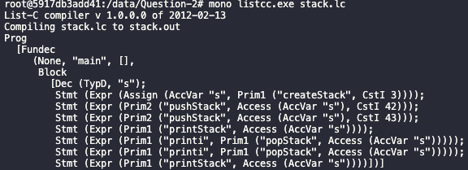

### 2.
For at kunne compile og kører programmet så har jeg oprettet instruktionerne med korresponderende numeric byte code instruktion inde i `Machine.fs`:
```F#
type instr =
  | ...                        (* set second field of cons cell   *)
  | CREATESTACK
  | PUSHSTACK
  | POPSTACK
  | PRINTSTACK

let CODECREATESTACK = 32;
let CODEPUSHSTACK = 33;
let CODEPOPSTACK = 34;
let CODEPRINTSTACK = 35;
```

Så er der blevet tilføjet kode til når det er label miljøer bliver lavet:
```F#
let makelabenv (addr, labenv) instr = 
    match instr with
    | ...
    | CREATESTACK    -> (addr+1, labenv)
    | PUSHSTACK      -> (addr+1, labenv)
    | POPSTACK       -> (addr+1, labenv)
    | PRINTSTACK     -> (addr+1, labenv)
```

Samt tilføjet til konverteringen fra typen `instr` til en `int`:
```F#
let rec emitints getlab instr ints = 
    match instr with
    | ...
    | CREATESTACK    -> CODECREATESTACK :: ints
    | PUSHSTACK      -> CODEPUSHSTACK :: ints
    | POPSTACK       -> CODEPOPSTACK :: ints
    | PRINTSTACK     -> CODEPRINTSTACK :: ints
```

I vores `listmachine.c` har jeg først tilføjet instruktions tallene for de respektive keywords:
```C
#define CREATESTACK 32
#define PUSHSTACK 33
#define POPSTACK 34
#define PRINTSTACK 35
```

Herefter for at kunne lave et trace har jeg tilføjet kode til at kunne printe instruktionerne ud i tekst:
```C
void printInstruction(word p[], word pc) {
  switch (p[pc]) {
    ...
    case CREATESTACK: printf("CREATESTACK"); break;
    case PUSHSTACK: printf("PUSHSTACK"); break;
    case POPSTACK: printf("POPSTACK"); break;
    case PRINTSTACK: printf("PRINTSTACK"); break;
    ...
  }
}
```

For at definere den adfærd som de nye keywords skal have har jeg tilføjet nye case statements i `execcode()`:
```C
int execcode(word p[], word s[], word iargs[], int iargc, int /* boolean */ trace) {
	
  word bp = -999;        // Base pointer, for local variable access 
  word sp = -1;          // Stack top pointer
  word pc = 0;           // Program counter: next instruction
  for (;;) {
    if (trace)
      printStackAndPc(s, bp, sp, p, pc);
    switch (p[pc++]) {
        ...
        case CREATESTACK: {
      
            int n = Untag(s[sp]);

            if (n < 0) {
                printf("Cannot create a stack with a size less than 0\n"); 
                return -1;
            }

            uword allocation_length = n + 3; // As described in the assignement, n + 3 
            word *p = allocate(STACKTAG, allocation_length, s, sp);
            p[1] = n;
            p[2] = 0;

            s[sp] = p; // Place the pointer onto the stack
        } break;
        case PUSHSTACK: {
            word *p = (word*)s[sp-1];
            int v = Untag(s[sp]);
            int n = p[1];
            int top = p[2];

            if(n == top) {
                printf("Stack is full\n");
                return -1;
            }
            
            p[2+top+1] = v;
            p[2] = top+1;
        sp--; // Decrement to remove value from the real stack
        } break;
        case POPSTACK: {
            word *p = s[sp];
            int n = p[1];
            int top = p[2];

            if (top == 0) {
                printf("There is nothing left to pop\n"); 
                return -1;
            }

            int v = p[2+top];
            p[2] = top - 1;
        s[sp] = Tag(v);
        } break;
        case PRINTSTACK: {
            word *p = s[sp];
            int n = p[1];
            int top = p[2];

            // Print the header information
            printf("STACK(%d, %d) [", n, top);

            // Print values of the stack
            for (int i = 1; i < top; i++)
            {
                int v = p[2+i];
                printf("%d, ", v);
            }

            // Print the end of the stack
            if(top != 0) {
                int v = p[2+top];
                printf("%d]\n", v);
            } else {
                printf("]\n");
            }

        } break;
        ...
  }
}
```

### 3.
Jeg har udvidet `Comp.fs` med følgende linjer:
```F#
and cExpr (e : expr) (varEnv : varEnv) (funEnv : funEnv) : instr list = 
    match e with
    | ...
    | Prim1(ope, e1) ->
      cExpr e1 varEnv funEnv
      @ (match ope with
         | ...
         | "createStack"  -> [CREATESTACK]
         | "popStack"     -> [POPSTACK]
         | "printStack"   -> [PRINTSTACK]
         | ...
    | Prim2(ope, e1, e2) ->
      cExpr e1 varEnv funEnv
      @ cExpr e2 varEnv funEnv
      @ (match ope with
         | ...
         | "pushStack"    -> [PUSHSTACK]
         | ...
```

Det har givet følgende resultat:

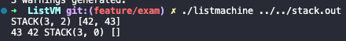

### 4.
For at test om `createStack` virker, så er det en god ide at teste om den kan lave den, som vi allerede har gjort. Men `createStack` har nogle edge cases som er gode at få testet. Her i blandt er der:
- kan lave en stack som har en størrelse på 
- kaster en fejl når det er man prøver at lave en stack hvor $n < 0$.

**Test case hvor $n = 0$**
```C
void main() {
    dynamic s;
    s = createStack(0);
    printStack(s);
}
```

Output:

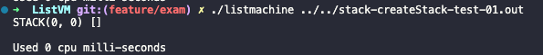

**Test case hvor $n < 0$**
```C
void main() {
    dynamic s;
    s = createStack(-1);
    printStack(s);
}
```

Output:

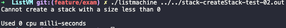

#### `pushStack` Tests
For at teste `pushStack` har vi de generelle edge cases igen:
- Kan man push en værdi på stakken når der ikke er flere pladser
- Pushe en værdi på den allersidste plads
- Pushe en værdi når det er at stakken er tom

Herudover, skal der testes om det er muligt at push en værdi efter hindanden og sikre sig at de ikke bliver overskrevet. 
Derfor har jeg lavet følgende 2 test cases:

**Test case hvor der ikke er flere pladser tilbage i stacken**
```C
void main (){
    dynamic s;
    s = createStack(0);
    pushStack(s, 1);
}
```
Output:

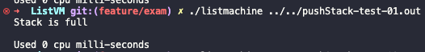

**Test case hvor der er pladser tilbage og hver der bliver indsat på henholdsvis første og sidste plads**
```C
void main(){
    dynamic s;
    s = createStack(2);

    pushStack(s,1);
    printStack(s);
    pushStack(s,500);
    printStack(s);
}
```

Output:

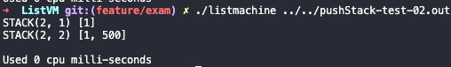

## Opgave 3

### 1.
Jeg har tilføjet følgende linje i `Absyn.fs`:
```F#
type typ =
    | ...
    | TypT of typ * int optio
```

Det giver følgende resultat:

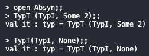

Herudover for at kunne tilgå bestemte værdier i en tupel er følgende type blevet tilføjet i `Absyn.fs`:
```F#
and access =                                                       
    | ...
    | TupIndex of access * expr
```

Hvilket tillader os at lave abstrakte syntaks træer, som signalere at vi gerne vil hente en værdi på en speciel plads i en tupel:

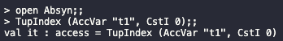