# Programmer som data - Eksamen
Andreas Nicolaj Tietgen, anti@itu.dk, Kursus kode: BSPRDAT1KU

Jeg erklærer hermed at jeg selv har lavet hele denne eksamensbesvarelse uden hjælp fra andre.

## Opgave 1

### Delopgave 1. 
For at kunne udskrive numbers er følgende blevet skrevet.
```F#
Every (Write (numbers));;
```
Det giver nedenstående output:


Løsningen virker ved at gøre brug at continuations. For `Every` bliver der dannet en continuation "genstarter" hele processen som bliver defineret i `FromTo` kald til den dannede `cont`. Herefter opretter vi en continuation for `Write` ved at først få den til at udskrive den værdi som continuationen får ind også herefter kalde den givet continuation. I `FromTo` er hvor det hele bliver sat sammen. Med de continuations, som er blevet sammen sat, gør `FromTo` brug af dem ved at lave en `loop` funktion som kalder den dannede continuation. Det vigtige er her at den giver værdien med samt laver en continuation funktion, som kalder `loop i+1`. Når denne dannet continuation bliver kaldt i `Every` så kører loop igen samt indtil det er at $i < n$.

### Delopgave 2.
For at skrive tal fra `numbers` som er større end 10 så kan følgende blive skrevet:
```F#
Every(Write(Prim("<", CstI (10), numbers)));;
```
Det giver nedenstående output:


Det først stykke fungere nogenlunde på samme måde som svaret til delopgave 1. Men `Prim` danner en continuation funktion som bliver kaldt af `loop`. Her vurdere `Prim` om `10 < v2`. Hvis den er det gør den brug af continuation funktion som skriver værdien ud. Ellers gør den brug af den continuation funktion, som fortsætter loopet.

### Delopgave 3. 
For at kunne udskrive de tal som er større end for sekvensen af numbers kan følgende blive skrevet:
```F#
(Every (Write (Prim("<", numbers, Seq(Write(CstS("\n")), numbers)))));;
```
Det giver følgende output i terminalen:


De først 3 typer er forklaret i henholdsvis de ovenstående opgaver. Dog er der en ændring med `Prim("<", e1, e2)`. Den evaluerer stadig `e1` først og herefter `e2`. Forskellen er her at `e1` er blevet ændret til en `FromTo(5, 12)` og `e2` er ændret til en `Seq(Write(CstS("\n")), numbers)`. Ændringen af `e1` gør at at den kører evalueringen af `e2` indtil `FromTo` rammer 12. 
`e2` skriver først en newline karakter ud til terminalen, herefter begynder den loopet med `FromTo` og bruger continuation funktionen til at vurdere hvilke tal der skal skrives ud.

### Delopgave 4.
For at løse opgaven antager jeg at vi har med et alfabet som kun har store bogstaver og som kun indeholder ASCII bogstaver fra A-Z.

Koden for at løse dette er således:
```F#
let rec eval (e : expr) (cont : cont) (econt : econt) = 
    match e with
    | ...
    | FromToChar (c1, c2) -> 

      // Create loop function to provide chars to the continuation function  
      let rec loop = function
        | c :: cs -> cont (Str (c.ToString())) (fun () -> loop cs) 
        | [] -> econt ()

      // Create a function that checks that the char, c, is between ch1 and ch2
      let charIsBetweenInclusive (c, ch1, ch2) =
        let cv = int(c)
        let cv1 = int(ch1)
        let cv2 = int(ch2)

        cv >= cv1 && cv <= cv2
      
      // Check that c2 is greater than or equal to c1
      match (System.Char.ToUpper(c1), System.Char.ToUpper(c2)) with
      | ch1, ch2 when int(c2) - int(c1) < 0 -> Str "c2 is not greater than c1"
      | ch1, ch2 -> 
        "ABCDEFGHIJKLMNOPQRSTUVWXYZ".ToCharArray() 
        |> List.ofArray 
        |> List.filter (fun c -> charIsBetweenInclusive (c, ch1, ch2))
        |> loop
```

`FromToChar` er lavet med inspiration fra `FromTo`, som det kan ses ved brugen af `loop`. Ændringen ligger i at det er med typen `char` istedet for `int`. Først opretter vi loop funktionen og `charIsBetweenInclusive`. `charIsBetweenInclusive` er en predicate som tjekker om det angivne værdi `c` er i mellem `c1` og `c2`. Når de to funktioner er blevet oprettet, bliver der tjekket om `c2` er større eller lig med `c1`. Det gør vi for at kunne give karakterer som er i rækkefølge. Hvis de er det så laver vi en liste af de karakterer som er i mellem `ch1` og `ch2` og kører loopet indtil der ikke er flere elementer tilbage.


### Delopgave 5.
For at løse dette eksempel er følgende tilføjet til evalueringen af `Prim`:
```F#
let rec eval (e : expr) (cont : cont) (econt : econt) = 
    match e with
    | ...
    | Prim(ope, e1, e2) -> 
      eval e1 (fun v1 -> fun econt1 ->
          eval e2 (fun v2 -> fun econt2 -> 
              match (ope, v1, v2) with
              | ...
              | ("<", Str s1, Str s2) -> 
                if s1 < s2 then
                  cont (Str s2) econt2
                else 
                  econt2 ()
              econt1)
          econt
```

Det har givet følgende resultat når det bliver kørt i terminalen:


### Delopgave 6.
Jeg har skrevet følgende udtryk:
```
Every(Write(Prim("<", CstS "G", chars)));;
```

Dette giver nedenstående resultat:


Det fungere næsten på samme måde som forklaringen ved delopgave 2. Forskellen er her at der bliver loopet med `char` i stedet for en `int`. Så når det er at `Prim` skal vurdere om `"G" < c` så bliver det gjort ved den indbyggede sammenlignings funktionalitet der er i F# sproget. 

## Opgave 2

### Delopgave 1. 

For at kunne parse de nye keywords, så bliver vi nødt til at generere dem som tokens først ved hjælp af vores lexer, `CLex.fsl`:
```F#
let keyword s =
    match s with
    | ...
    | "createStack" -> CREATESTACK
    | "pushStack" -> PUSHSTACK
    | "popStack" -> POPSTACK
    | "printStack" -> PRINTSTACK
    | ... 
```

Herefter skal vi registrere de nye tokens i vores Parser specification, `CPar.fsy`:
```F#
%token CHAR ELSE ... PUSHSTACK PRINTSTACK POPSTACK CREATESTACK
```
Som der kan ses har jeg valgt at placere dem på samme linje som `CHAR`, `ELSE`, `IF`, `INT`, `NULL`, `PRINT`, `PRINTLN`, `RETURN`. `VOID` og `WHILE`

Ved hjælp af de nye tokens, kan vi nu begynde at lave vores grammar og specificere hvordan vores stack tokens i sammespil med andre tokens kommer til at blive dannet til et abstrakt syntaks træ:
```F#
ExprNotAccess:                                                 
    ...
  | PRINTSTACK LPAR Expr RPAR           { Prim1("printStack", $3) }
  | ...
;

AtExprNotAccess:
    ...
  | CREATESTACK LPAR Expr RPAR          { Prim1("createStack", $3)  }
  | PUSHSTACK LPAR Expr COMMA Expr RPAR { Prim2("pushStack", $3, $5)}
  | POPSTACK LPAR Expr RPAR             { Prim1("popStack", $3)     }
;
```

Når det er gjort, generere det følgende abstrakte syntaks træ for `stack.cl`:


### Delopgave 2.
For at kunne compile og kører programmet så har jeg oprettet instruktionerne med korresponderende numerisk byte kode instruktion inde i `Machine.fs`:
```F#
type instr =
  | ...                        
  | CREATESTACK
  | PUSHSTACK
  | POPSTACK
  | PRINTSTACK

let CODECREATESTACK = 32;
let CODEPUSHSTACK = 33;
let CODEPOPSTACK = 34;
let CODEPRINTSTACK = 35;
```

Så er der blevet tilføjet kode til når det er label miljøer bliver lavet:
```F#
let makelabenv (addr, labenv) instr = 
    match instr with
    | ...
    | CREATESTACK    -> (addr+1, labenv)
    | PUSHSTACK      -> (addr+1, labenv)
    | POPSTACK       -> (addr+1, labenv)
    | PRINTSTACK     -> (addr+1, labenv)
```

Samt tilføjet til konverteringen fra typen `instr` til en `int`:
```F#
let rec emitints getlab instr ints = 
    match instr with
    | ...
    | CREATESTACK    -> CODECREATESTACK :: ints
    | PUSHSTACK      -> CODEPUSHSTACK :: ints
    | POPSTACK       -> CODEPOPSTACK :: ints
    | PRINTSTACK     -> CODEPRINTSTACK :: ints
```

I vores `listmachine.c` har jeg først tilføjet instruktions tallene for de respektive keywords:
```C
#define CREATESTACK 32
#define PUSHSTACK 33
#define POPSTACK 34
#define PRINTSTACK 35
```

Herefter for at kunne lave et trace har jeg tilføjet kode til at kunne printe instruktionerne ud i tekst:
```C
void printInstruction(word p[], word pc) {
  switch (p[pc]) {
    ...
    case CREATESTACK: printf("CREATESTACK"); break;
    case PUSHSTACK: printf("PUSHSTACK"); break;
    case POPSTACK: printf("POPSTACK"); break;
    case PRINTSTACK: printf("PRINTSTACK"); break;
    ...
  }
}
```

For at definere den adfærd som de nye keywords skal have har jeg tilføjet nye case statements i `execcode()`:
```C
int execcode(word p[], word s[], word iargs[], int iargc, int /* boolean */ trace) {
	
  word bp = -999;        // Base pointer, for local variable access 
  word sp = -1;          // Stack top pointer
  word pc = 0;           // Program counter: next instruction
  for (;;) {
    if (trace)
      printStackAndPc(s, bp, sp, p, pc);
    switch (p[pc++]) {
        ...
        case CREATESTACK: {
      
            int n = Untag(s[sp]);

            if (n < 0) {
                printf("Cannot create a stack with a size less than 0\n"); 
                return -1;
            }

            uword allocation_length = n + 3; // As described in the assignement, n + 3 
            word *p = allocate(STACKTAG, allocation_length, s, sp);
            p[1] = n;
            p[2] = 0;

            s[sp] = p; // Place the pointer onto the stack
        } break;
        case PUSHSTACK: {
            word *p = (word*)s[sp-1];
            int v = Untag(s[sp]);
            int n = p[1];
            int top = p[2];

            if(n == top) {
                printf("Stack is full\n");
                return -1;
            }
            
            p[2+top+1] = v;
            p[2] = top+1;
        sp--; // Decrement to remove value from the real stack
        } break;
        case POPSTACK: {
            word *p = s[sp];
            int n = p[1];
            int top = p[2];

            if (top == 0) {
                printf("There is nothing left to pop\n"); 
                return -1;
            }

            int v = p[2+top];
            p[2] = top - 1;
        s[sp] = Tag(v);
        } break;
        case PRINTSTACK: {
            word *p = s[sp];
            int n = p[1];
            int top = p[2];

            // Print the header information
            printf("STACK(%d, %d) [", n, top);

            // Print values of the stack
            for (int i = 1; i < top; i++)
            {
                int v = p[2+i];
                printf("%d, ", v);
            }

            // Print the end of the stack
            if(top != 0) {
                int v = p[2+top];
                printf("%d]\n", v);
            } else {
                printf("]\n");
            }

        } break;
        ...
  }
}
```

### Delopgave 3.
Jeg har udvidet `Comp.fs` med følgende linjer:
```F#
and cExpr (e : expr) (varEnv : varEnv) (funEnv : funEnv) : instr list = 
    match e with
    | ...
    | Prim1(ope, e1) ->
      cExpr e1 varEnv funEnv
      @ (match ope with
         | ...
         | "createStack"  -> [CREATESTACK]
         | "popStack"     -> [POPSTACK]
         | "printStack"   -> [PRINTSTACK]
         | ...
    | Prim2(ope, e1, e2) ->
      cExpr e1 varEnv funEnv
      @ cExpr e2 varEnv funEnv
      @ (match ope with
         | ...
         | "pushStack"    -> [PUSHSTACK]
         | ...
```

Det har givet følgende resultat:


### Delopgave 4.

#### `createStack` Tests:

For at teste om `createStack` virker, så er det en god ide at teste om den kan lave den, som vi allerede har gjort. Men `createStack` har nogle edge cases som er gode at få testet. Her i blandt er der:
- Kan den lave en stack som har en størrelse på 0 
- Kaster en fejl når det er man prøver at lave en stack hvor $n < 0$.
- Laver den en stack med den korrekte størrelse


**Test case hvor $n = 0$**
```C
void main() {
    dynamic s;
    s = createStack(0);
    printStack(s);
}
```

Output:


**Test case hvor $n < 0$**
```C
void main() {
    dynamic s;
    s = createStack(-1);
    printStack(s);
}
```

Output:


#### `pushStack` Tests:

For at teste `pushStack` har vi de generelle edge cases igen:
- Kan man push en værdi på stacken når der ikke er flere pladser
- Pushe en værdi på den allersidste plads
- Pushe en værdi når det er at stakken er tom

Herudover, skal der testes om det er muligt at push en værdi efter hindanden og sikre sig at de ikke bliver overskrevet. 
Noget andet man også kunne teste var hvilke typer af værdier man kunne pushe til stacken. Men da heap kun accepterer integers(pga. brugen af funktionerne Tag og Untag) så dette ikke en mulighed. 

Der er lavet følgende 2 test cases:

**Test case hvor der ikke er flere pladser tilbage i stacken**
```C
void main (){
    dynamic s;
    s = createStack(0);
    pushStack(s, 1);
}
```
Output:


**Test case hvor der er pladser tilbage og hver der bliver indsat på henholdsvis første og sidste plads**
```C
void main(){
    dynamic s;
    s = createStack(2);

    pushStack(s,1);
    printStack(s);
    pushStack(s,500);
    printStack(s);
}
```

Output:


**Forklaring af modifikationerne**
Udklip af ændringerne er vist ved de givne delopgaver. De angivne ændringer til Lexer og Parser specifikationer er lavet så vi kan omdanne tekst til den abstrakte syntaks. I delopgave 1 kan det ses at Lexer specifikationen har fået tilføjet keywords, som bliver omdannet til de angivne tokens. Herudover kan det ses i parser specifikationen at disse tokens ogsåer blevet tilføjet samt regler til at kunne omdanne en sekvens af tokens til abstrakt syntaks. 

I delopgave 2 bliver vi bedt om at lave ændringer så vi kan både lave instruktioner om til numerisk byte kode, ved at ændre i `Machine.fs` men også at lave fortolkeren i `listmachine.c`. 
Det er blevet gjort ved først at definere hvilken numerisk værdi de forskellige instruktioner har. Herefter bliver der i `Machine.fs` indsat kode i `emitints` for at kunne danne en instruktions liste med de nye instruktions numre. Herefter, går vi ind og definere logikken af de forskellige instruktioner. Det gør vi i `listmachine.c` ved at tilføje cases i `execcode()` funktionen. Logikken er blevet implementeret i overenstemmelse med de regler, om hvordan stacken skal se ud før og efterfølgende. Det vigtige har dog været at hente integer værdi fra stacken med `Untag` macroen, således at vi får den rigtige værdi. Herudover, er det også vigtigt at når det er vi ligger noget ned i den oprindelige stack igen, fx ved `popStack`, at den bliver lagt på med den tagged værdi ved hjælp af `Tag` macroen. Grunden til brugen af de to macroer til at tagge og untagge en værdi, er på grund af at Garbage collecteren bruger tagget til at finde ud af om det er en pointer til noget i heap'en.

Til sidst i delopgave 3, skal vi lave vores compiler således at vi går fra abstrakt syntaks til numerisk byte kode instruktioner, i `Comp.fs`. Her er der kun blevet lavet håndtering af `Prim` typen, som indeholder de givne keywords til operationer for stacken, i funktionen `cExpr`. I `cExpr` omdanner vi den abstrakte syntakt til en liste af instruktioner, som senere, ved hjælp af `Machine.fs` funktion `code2ints`, omdanner dem til en liste af numerisk byte kode. 

Det er denne list som `listmachine` udfører de regler, som vi tidligere har beskrevet.

## Opgave 3

### Delopgave 1.
Jeg har tilføjet følgende linje i `Absyn.fs`:
```F#
type typ =
    | ...
    | TypT of typ * int optio
```

Det giver følgende resultat:


Herudover for at kunne tilgå bestemte værdier i en tupel er følgende type blevet tilføjet i `Absyn.fs`:
```F#
and access =                                                       
    | ...
    | TupIndex of access * expr
```

Hvilket tillader os at lave abstrakte syntaks træer, som signalere at vi gerne vil hente en værdi på en speciel plads i en tupel:


### Delopgave 2.
For at kunne parse en tuppel, er følgende blevet oprettet som tokens inde i `CLex.fsl`:

```F#
rule Token = parse
    | ...
    | "(|"            { LPARBAR }
    | "|)"            { BARRPAR }
    | ...
```
### Delopgave 3.

Jeg har registreret de nye tokens i parser specifikationen `CPar.fsy`:
```F#
%token LPAR RPAR LBRACE RBRACE LBRACK RBRACK SEMI COMMA ASSIGN AMP LPARBAR BARRPAR
```

Herudover er `LPARBAR` tilføjet med samme precedence som `LBRACK` og dermed er den også `%nonassoc`:
```F#
%nonassoc LBRACK LPARBAR 
``` 

Samt parsing af både at oprette en tupel samt at tilgå værdier:
```F#
Vardesc: 
    ...
    | Vardesc LPARBAR BARRPAR             { compose1 (fun t -> TypT(t, None)) $1    }
    | Vardesc LPARBAR CSTINT BARRPAR      { compose1 (fun t -> TypT(t, Some $3)) $1 }
;

Access:
    ...
    | Access LPARBAR Expr BARRPAR         { TupIndex($1, $3)    }
;
```

Både lexer og parser bliver compilet via et script som ser således ud:
```
#!/bin/bash
binDir=/data/bin
currDir=$PWD

mono $binDir/fslex.exe --unicode CLex.fsl
mono $binDir/fsyacc.exe --module CPar CPar.fsy

...
```

Resultatet af at compile lexer og parser ser således ud:

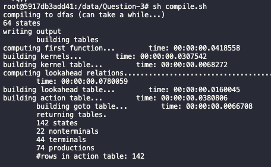

og output når eksemplerne bliver parset om til abstrakt syntaks ser således ud:

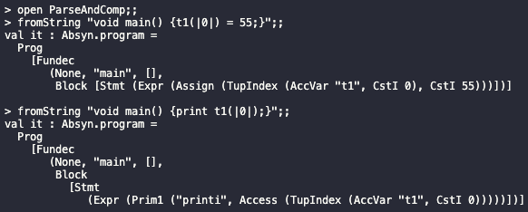

### Delopgave 4. 
Her er følgende ændringer til `Comp.fs`:

```F#
let allocate (kind : int -> var) (typ, x) (varEnv : varEnv) : varEnv * instr list =
    let (env, fdepth) = varEnv 
    match typ with
    | ...
    | TypT (TypT _, _) -> 
      raise (Failure "allocate: tupel of tupel is not permitted")
    | TypT (t, Some i) -> 
      let newEnv = ((x, (kind (fdepth), typ)) :: env, fdepth+i) 
      let code = [INCSP i]
      (newEnv, code)
    | ...

and cAccess access varEnv funEnv : instr list =
    match access with 
    | ...
    | TupIndex(acc, idx) -> 
      cAccess acc varEnv funEnv @ cExpr idx varEnv funEnv @ [ADD]
```

### Delopgave 5.
I ovenstående delopgave kan man se ændringerne i de givne filer.

De ændringer der er lavet i lexer specifikationen er til for at danne tokens af følgende form `(|` `|)` kaldet `LPARBAR` og `BARRPAR`. Disse tokens er vigtige da de skal benyttes af vores parser til at omdanne det til abstrakt syntaks. Derfor har vi i parser specifikationen også registreret de givne tokens, `LPARBAR` og `BARRPAR`, så vi kan begynde at specificere hvordan en tuppel bliver erklæret og hvordan man kan tilgå dets elementer. Dertil bliver der oprettet nogle regler i henholdsvis `Vardesc` og `Access`, som sørger for at lave de angive regler, om til abstrakt syntaks. Alle typerne i det abstrakt syntaks er angivet i `Absyn.fs`. 

Herudover, skal vi have lavet vores abstrakte syntaks til noget byte kode. Det er det vi bruger `Comp.fs` til. I `Comp.fs` skal der tilføjes noget to steder. I henholdsvis `allocate` og `cAccess`. I Allocate er det meningen, at vi skal definere hvordan vi gemmer tuppel værdierne på stacken. Det bliver gjort ved at give værdierne en type og herefter indikere hvor mange værdier der skal være plads til. Det indikere vi ved at sige `fdepth+i` på `varEnv`'s variabel offset, hvor `fdepth` er værdien for den nuværende offset og `i` er antallet af værdier i tupplen. Tilsidst bliver stack pointeren forøget med `i`.
Herudover er der tilføjet en regel, som fejl tjek, i det tilfælde at der bliver forsøgt at oprette en tuppel i en tuppel.

I `cAccess` skal vi lave numerisk byte kode til at hente værdier i tupplen. Da tupplen bare er en lang række værdier på stacken, kan vi hente addressen for den første variable ved at sige `cAccess acc varEnv funEnv`. Herefter henter vi den position som vi gerne vil have værdien fra og tilføjer en byte code instruktion, som ligger de to værdier(addresser) sammen.

Herved har vi implementationen af en tuppel i Micro-c sproget.

### Delopgave 6.
Efter at have compileret `tupple.out` og kører det med `Machine.java`, kommer dette output:

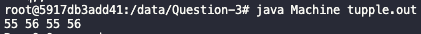

## Opgave 4

### Delopgave 1.
Jeg har udvidet `Absyn.fs` med følgende:
```F#
type expr = 
    | ...
    | List of expr list
```

Lexer specificationen, `FunLex.fsl`, har fået følgende tilføjet:
```F#
rule Token = parse
    | ...
    | '@'             { CADD }
    | ','             { COMMA }
    | '['             { LCBRACK }
    | ']'             { RCBRACK }
    | ...
```

Parser specifikationen, `FunPar.fsy`, har fået følgende tilføjet tokens `COMMA`, `CADD`, `LCBRAC` og `RCBRACK`:
```F#
%token PLUS MINUS TIMES DIV MOD CADD
%token LPAR RPAR LCBRACK RCBRACK COMMA

...
%left PLUS MINUS CADD
...
```
Som der kan ses så har `CADD` fået samme præcedence og associativitet som `PLUS`. 
Herudover er der tilføjet følgende type i parser specifikationen:
```F#
%type <Absyn.expr list> ListExpr
```

Til sidst er der tilføjet følgende parser regler:
```F#
Expr:
    ...
    | LCBRACK ListExpr RCBRACK            { List ($2)              }
    | Expr CADD  Expr                     { Prim("@", $1, $3)      }

ListExpr:
    Expr                                  { [$1]                   }
    | Expr COMMA ListExpr                 { $1 :: $3               }
```

Her er output fra ex01:

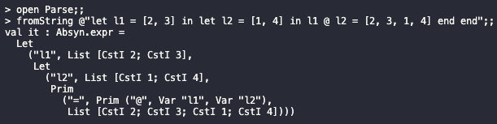

Følgende billeder viser output fra listen af eksempler. De bliver vist efter samme rækkefølge som i opgaven:

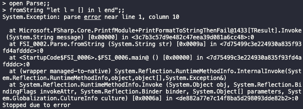

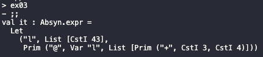

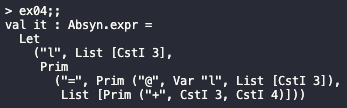

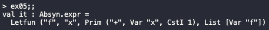

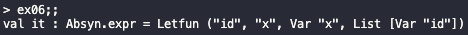

### Delopgave 2.
I HigherFun er der først blevet tilføjet typen `ListV of value list`:
```F#
type value = 
    | ...
    | ListV of value list
``` 

Herefter er der tilføjet følgende evaluerings regler:
```F#
let rec eval (e : expr) (env : value env) : value =
    match e with
    | ...
    | List l -> l |> List.map (fun v -> eval v env) |> ListV
    | Prim(ope, e1, e2) -> 
      let v1 = eval e1 env
      let v2 = eval e2 env
      match (ope, v1, v2) with
      | ...
      | ("@", ListV l1, ListV l2) -> ListV (l1 @ l2)
      | ("=", ListV l1, ListV l2) -> 
        match l1 = l2 with
        | true -> Int 1
        | false -> Int 0
      |  _ -> failwith "unknown primitive or wrong type"
    | ...
```

I billedet under bliver der vist en række af kørsler. Alle resultater fra eksemplerne ex01 til og med ex06 er vist. 
Bemærk at jeg har gjort brug af at gemme eksempler som variabler og kører dem istedet. Dog er det ikke muligt at gemme ex02 da den giver fejl, i det den prøver at lave en tom liste:

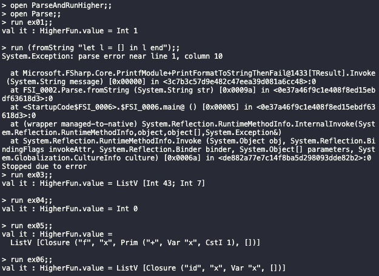

### Delopgave 3.
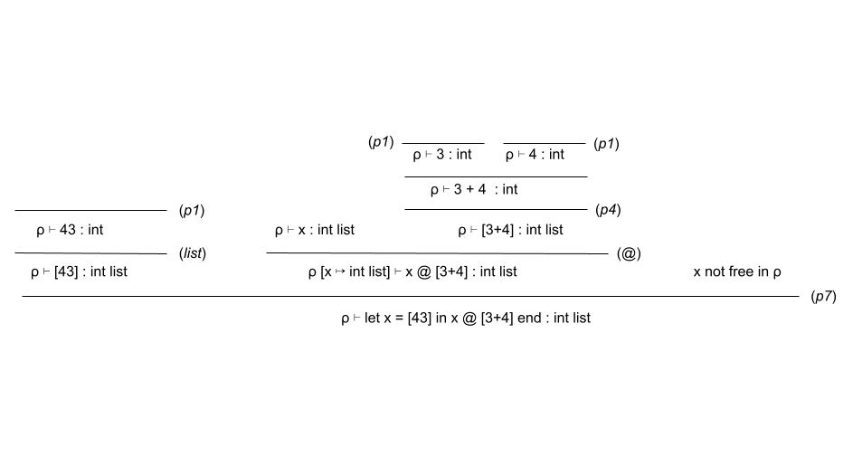

